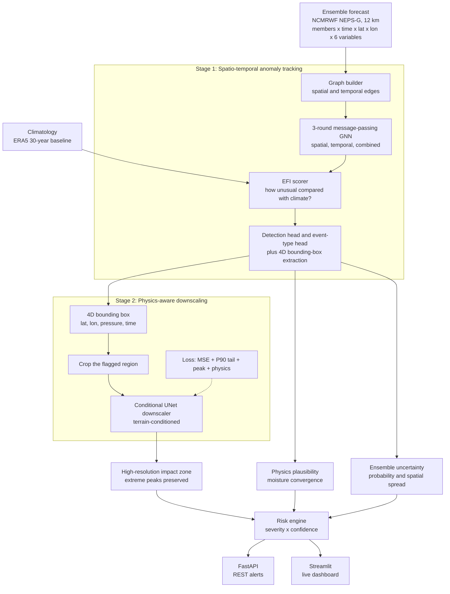
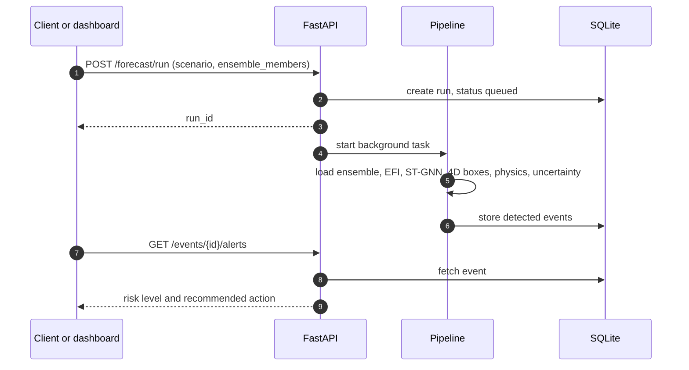
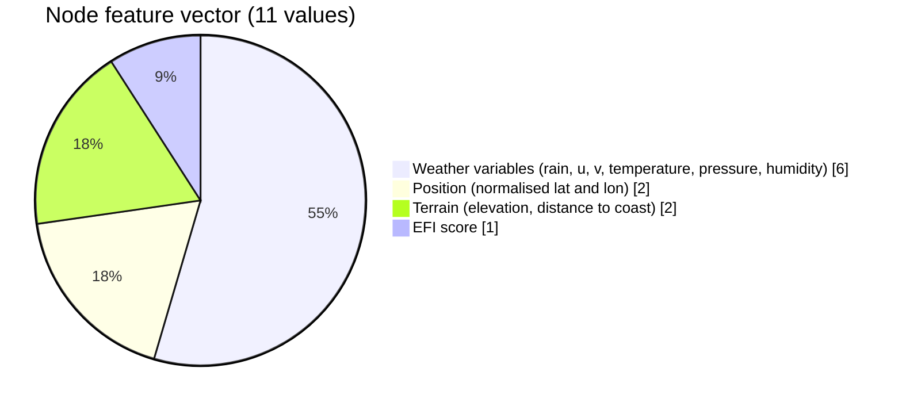
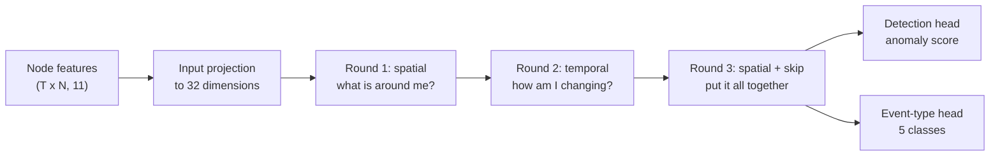
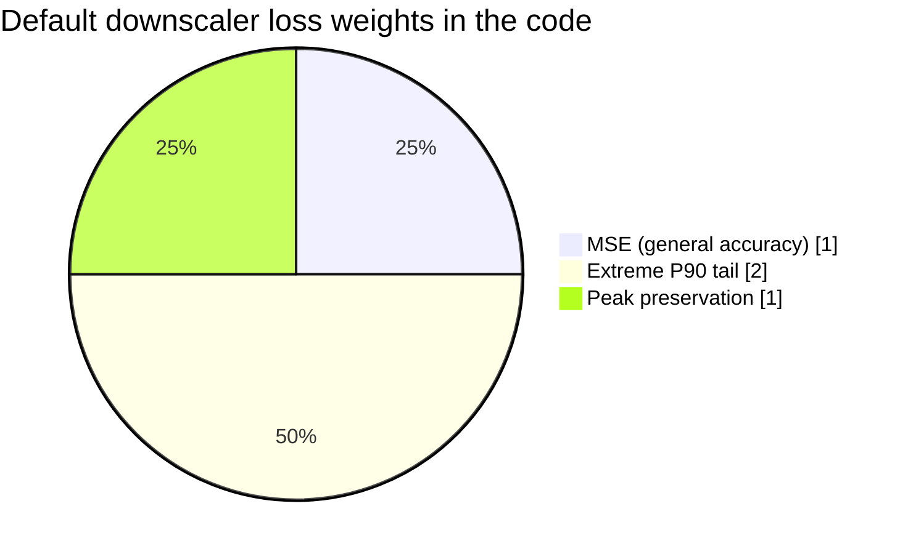
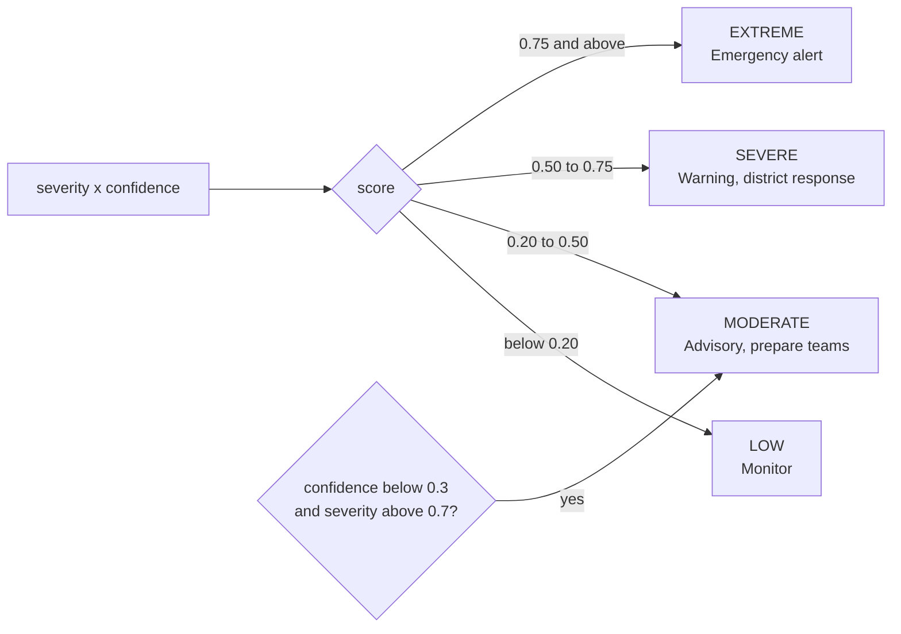
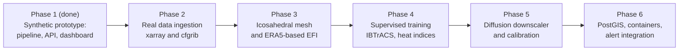

<div align="center">

# AI-Driven Spatio-Temporal Tracking of Extreme Weather Anomalies

### Find the storm. Follow it. Zoom in. Warn people.

A two-stage AI pipeline that finds dangerous weather (cyclones, heatwaves, cold waves, extreme rainfall) inside large global ensemble forecasts, tracks it through time, sharpens the affected region, and turns the result into a graded risk alert.

[](https://aidrivenextremeweathertracking-zqbyzcqonsgmlcmqofwyzp.streamlit.app/)


[Live App](https://aidrivenextremeweathertracking-zqbyzcqonsgmlcmqofwyzp.streamlit.app/) | [Architecture](#system-architecture) | [How it works](#how-it-works) | [Quickstart](#installation-and-quickstart) | [API](#rest-alert-api)

</div>

---

## Contents

1. [Live demo](#live-demo)
2. [Project information](#project-information)
3. [The problem we are solving](#the-problem-we-are-solving)
4. [Our approach](#our-approach)
5. [What sets this project apart](#what-sets-this-project-apart)
6. [System architecture](#system-architecture)
7. [How it works](#how-it-works)
8. [Tech stack](#tech-stack)
9. [Test scenarios and evaluation](#test-scenarios-and-evaluation)
10. [Repository structure](#repository-structure)
11. [Installation and quickstart](#installation-and-quickstart)
12. [REST alert API](#rest-alert-api)
13. [What is real and what is simulated](#what-is-real-and-what-is-simulated)
14. [Roadmap](#roadmap)
15. [Team](#team)

---

## Live demo

The easiest way to see the project is to open the deployed app:

**https://aidrivenextremeweathertracking-zqbyzcqonsgmlcmqofwyzp.streamlit.app/**

Once it loads, a good way to explore it:

1. Pick a forecast scenario in the sidebar (`A`, `B`, `cyclone` or `heatwave`).
2. Choose a downscaling model: the bilinear baseline or the learned ConvDownscaler.
3. Drag the lead-time slider and watch the threat move across the forecast window.
4. Scroll down to the ensemble uncertainty panel, the regional downscaling view and the 4D threat registry.

Note: free Streamlit apps go to sleep when nobody has used them for a while. If you see a "wake up" screen, click the button and give it a few seconds.

---

## Project information

| | |
|---|---|
| Problem Statement ID | 26078 |
| Problem Statement | AI-Driven Spatio-Temporal Tracking of Extreme Weather Anomalies in Medium-Range Forecasts |
| Category and theme | Software, Weather and Disaster Management |
| Event | Smart India Hackathon 2026 |
| Institution | Jorhat Engineering College |
| Team | VisionX |

---

## The problem we are solving

Weather agencies do not run a forecast once. They run it many times from slightly different starting conditions, and the group of runs is called an ensemble. This is the best way to capture how uncertain the atmosphere is, but it produces huge four-dimensional datasets (members x time x latitude x longitude x variables). Today, forecasters still look through much of this by eye.

Here is what makes that hard:

- **It is slow and manual.** Checking 10 to 50 ensemble members across many maps does not scale, especially when time is short.
- **The atmosphere is chaotic.** Between 3 and 10 days out, tiny errors in the starting state grow, so the track, timing and strength of a storm all become uncertain.
- **Standard deep learning blurs the answer.** CNNs and U-Nets trained with plain MSE tend to average things out. That erases the exact peaks (strongest wind, heaviest rain) that forecasters care about.
- **There is a resolution gap.** Global ensembles are around 12 km, while disaster response needs local detail closer to 5 km.
- **Alerts lack shape.** A warning like "heavy rain in District X" says nothing about height in the atmosphere or exactly when it starts and ends.

Traditional methods also break down in specific, predictable ways:

| Situation | Traditional method | What goes wrong |
|---|---|---|
| Two storms merge or split | Match the nearest centroid | Track identity breaks. In our merging-storm test, continuity falls below 40%. |
| Several variables matter together | Watch rainfall alone | Heatwaves and early cyclone rotation get missed. |
| Local climate differs | Fixed thresholds, like "over 100 mm" | 50 mm can be catastrophic in a dry region while 100 mm is normal in a rainforest. |
| Black-box deep learning | Pure data-driven model | It can predict heavy rain where there is no moisture convergence to support it. |

---

## Our approach

We split the job in two, which we describe as "spot the storm, then zoom in on it."

| Stage | What it does | Technology | Output |
|---|---|---|---|
| Stage 1: Track | Scans the whole forecast and circles anything unusual | Spatio-temporal GNN plus EFI | A moving 4D bounding box for each anomaly |
| Stage 2: Downscale | Zooms into only that region and sharpens it without blurring the peaks | Physics-aware conditional downscaler | A high-resolution impact map with extremes preserved |

Instead of a vague regional warning, the system can produce a precise statement such as:

> "Cyclone threat between 14N and 18N and 82E to 87E, up to 300 hPa, from T+18 h to T+42 h, high confidence, extreme risk."
> (Illustrative wording. Real values come from a pipeline run.)

---

## What sets this project apart

**The atmosphere is treated as a graph in space and time.** Every grid cell at every time step is a node, with edges to its neighbours and to itself at the next time step. This is why a track can survive two storms merging, which is where distance-based matching falls apart.

**Detection is relative to local climate.** We use the Extreme Forecast Index (EFI) instead of fixed thresholds, so the same system behaves sensibly in dry and wet regions.

**Physics is part of the check.** Each detection gets a plausibility score based on moisture convergence. If the atmosphere could not support the storm, its confidence drops.

**The downscaler is built to keep peaks.** Its loss adds an extreme-tail term and a peak term on top of MSE, aimed directly at the smoothing problem.

**Uncertainty is a first-class output.** Because we work with the whole ensemble, results come as a probability and a spread, not a single fragile guess.

**The boxes are genuinely 4D.** Each one has a latitude range, longitude range, pressure range and start and end time.

**The alert rule is cautious.** Risk is severity multiplied by confidence, and a severe event with low confidence is capped at "moderate" to avoid false alarms.

**It is designed to be swapped onto real data.** Everything sits behind a fixed tensor shape `(E, T, H, W, 6)`. Moving to real NCMRWF and ERA5 data mostly means replacing the loader, the mesh and the climatology, not the model heads or the API.

---

## System architecture

### The full pipeline



### The layers at a glance

```mermaid
flowchart LR
    subgraph L1["1. Data"]
        D1["Synthetic generator<br/>(prototype)"]
        D2["NEPS-G and ERA5<br/>(target)"]
    end
    subgraph L2["2. Graph"]
        G1["11-value node features"]
        G2["Spatial and temporal edges"]
    end
    subgraph L3["3. Model"]
        M1["ST-GNN, 3 rounds"]
        M2["Detect, type, bbox"]
    end
    subgraph L4["4. Trust checks"]
        T1["EFI"]
        T2["Physics check"]
        T3["Ensemble spread"]
    end
    subgraph L5["5. Zoom"]
        Z1["ConvDownscaler"]
    end
    subgraph L6["6. Serve"]
        S1["FastAPI"]
        S2["Streamlit"]
    end
    L1 --> L2 --> L3 --> L4 --> L5 --> L6
```



### What happens when someone requests a run through the API



---

## How it works

### 1. Building the graph

Each grid cell at each time step becomes a node described by 11 numbers.



Spatial edges connect each cell to its four grid neighbours at the same time step, so information about wind flow, moisture and pressure gradients can travel. Temporal edges connect a cell to itself at the next time step, which carries motion and intensification forward.

The prototype uses a regular lat/lon grid for the spatial edges. The intended design is an icosahedral mesh, which avoids distortion near the poles. Because edge construction lives in one function (`build_spatial_edges()`), swapping it does not touch the GNN.

### 2. Three rounds of message passing



| Round | What each node listens to | What it learns |
|---|---|---|
| 1. Spatial | The mean of its 4 neighbours | Local circulation, pressure lows, moisture build-up |
| 2. Temporal | The previous and next time step | Movement direction and how fast it strengthens |
| 3. Combined | A second spatial pass on the time-aware features, with a skip connection | The overall space-time picture |

In equation form, the first two rounds are:

$$\mathbf{h}_v^{(1)}=\text{MLP}\big([\mathbf{x}_v\,\|\,\text{mean}_{u\in\mathcal N_s(v)}\mathbf{x}_u]\big)$$

$$\mathbf{h}_v^{(2)}=\text{MLP}\big([\mathbf{h}_v^{(1)}\,\|\,\tfrac12(\mathbf{h}^{(1)}_{v,t-1}+\mathbf{h}^{(1)}_{v,t+1})]\big)$$

The event classes are `cyclone`, `heatwave`, `cold_wave`, `extreme_rainfall` and `normal`.

### 3. Turning detections into 4D boxes

1. Threshold the per-node detection scores (default 0.3).
2. Average over time and run connected-component labelling to find distinct blobs.
3. Give each blob an event type from its average class probabilities, refined with simple checks on pressure, temperature and rainfall.
4. Build the box:

$$\mathcal B=\big([\text{lat}_{min},\text{lat}_{max}],\,[\text{lon}_{min},\text{lon}_{max}],\,[P_{surface},P_{top}],\,[t_{start},t_{end}]\big)$$

Each box also carries severity, confidence, probability of exceedance, physics plausibility and a risk level.

### 4. Extreme Forecast Index (EFI)

EFI asks a simple question: how unusual is this forecast compared with what the climate normally does at this location?

| EFI value | Meaning |
|---|---|
| Around 0 | The forecast looks like normal climate |
| Above +0.5 | An abnormal extreme is forecast (our alert trigger) |
| Around +1 | Almost every member is beyond what the record normally shows |

The prototype uses a closed-form approximation:

$$\text{EFI}\approx\frac{2}{\pi}\arcsin\!\left(\frac{F_{fc}-F_{clim}}{\sqrt{F_{fc}(1-F_{fc})+F_{clim}(1-F_{clim})+\epsilon}}\right)$$

The target design computes the full ECMWF integral against a 30-year ERA5 baseline.

### 5. The physics check

Heavy rain needs moisture to be drawn together. We measure that with moisture convergence:

$$\text{MC}=-\nabla\!\cdot(q\vec v)=-\Big(\tfrac{\partial(qu)}{\partial x}+\tfrac{\partial(qv)}{\partial y}\Big)$$

The module `physics_loss.py` uses this in two ways: as a training loss term for the downscaler, and at inference time as a plausibility score between 0 and 1 that lowers the confidence of detections the atmosphere would not support.

### 6. Ensemble uncertainty

Across all members, the system reports the event probability (the fraction of members that show the threat), the spatial spread (how far apart the predicted centres are, in degrees) and the intensity spread.

### 7. Downscaling without losing the peaks

The `ConvDownscaler` is a small UNet-style network with skip connections. It takes the rainfall field plus two terrain channels and produces a higher-resolution version of only the flagged region. Plain MSE would blur it, so the loss has extra terms:

$$\mathcal L=\mathcal L_{MSE}+\lambda_1\mathcal L_{extreme\,(P90)}+\lambda_2\mathcal L_{peak}\;(+\lambda_3\mathcal L_{physics})$$



| Term | Purpose |
|---|---|
| MSE | General accuracy |
| Extreme (P90) | Extra weight on the top 10% of values |
| Peak | Penalises the model when its maximum is lower than the true maximum |
| Physics | Discourages rain where moisture convergence is low |

### 8. Turning it into a risk level



---

## Tech stack

| Layer | Technology | Used for |
|---|---|---|
| Language | Python 3.10+ | The whole pipeline |
| Deep learning | PyTorch | ST-GNN, ConvDownscaler, custom losses |
| Graph modelling | Custom message-passing layers, inspired by GraphCast and GraphWeather | Spatio-temporal anomaly tracking |
| Scientific computing | NumPy, SciPy | EFI, climatology, connected components, finite-difference physics |
| Backend | FastAPI, Uvicorn, Pydantic | REST alert service and request validation |
| Storage | SQLite (in-memory for now), PostgreSQL/PostGIS planned | Event store |
| Frontend | Streamlit, Matplotlib | Interactive dashboard |
| Testing | pytest | Data generator and pipeline replay tests |
| Target data formats | xarray, cfgrib, NetCDF and GRIB2 | Reading NCMRWF NEPS-G and ERA5 |
| Hosting | Streamlit Community Cloud | Public demo |

Data sources:

| Source | Role |
|---|---|
| NCMRWF NEPS-G (12 km global ensemble) | Forecast input in the target design |
| ERA5 (30-year reanalysis) | Climate baseline for EFI in the target design |
| Built-in synthetic generator | What the prototype runs on today, with four scripted scenarios |

---

## Test scenarios and evaluation

### Built-in scenarios

| Scenario | What it simulates | Threshold baseline | ST-GNN pipeline |
|---|---|---|---|
| A | One localised storm crossing the domain | Tracks it fine | Produces a 4D box with high confidence |
| B | Two storms approaching and merging | Continuity drops and identity breaks | Uses spatial and temporal context through the merge |
| cyclone | A large rotating vortex moving north-west, Bay of Bengal style | The track breaks at the merge | Deep vertical range and rotating wind lead to a cyclone label |
| heatwave | A land-locked temperature anomaly | Missed by rainfall-only thresholds | The temperature channel is lifted by EFI, so it is caught |

### Metrics

The evaluator in `src/evaluation/metrics.py` computes:

| Area | Metrics |
|---|---|
| Tracking | Mean centroid error, IoU, track continuity |
| 4D boxes | Detection rate, mean bbox IoU, centroid error |
| Downscaling | MSE, P90 extreme-value error, peak-preservation error |
| Probability | Brier score and reliability table (a stub until real hindcasts are used) |

### Results

To reproduce, run:

```bash
python run_pipeline.py B
```

Then fill in the table from the printed output:

| Metric | Baseline detector | ST-GNN |
|---|---|---|
| Track continuity (merging storms) | _fill in_ | _fill in_ |
| Mean centroid error (grid units) | _fill in_ | _fill in_ |
| Mean bbox IoU | _fill in_ | _fill in_ |
| Peak preservation | Bilinear: _fill in_ | ConvDownscaler: _fill in_ |

---

## Repository structure

```
Weather_Forecasting_SIH/
├── README.md
├── app.py                          # Streamlit dashboard (the live demo)
├── run_pipeline.py                 # Command-line runner (ST-GNN plus baselines)
├── gnn_tracker.pth                 # Saved weights for the earlier baseline GNN tracker
│
├── api/
│   ├── main.py                     # FastAPI alert server with a SQLite event store
│   └── README.md                   # curl examples
│
├── src/
│   ├── data/
│   │   ├── synthetic_generator.py  # 6-channel ensemble generator with 4 scenarios
│   │   ├── climatology.py          # Synthetic climatology baseline
│   │   └── efi.py                  # Extreme Forecast Index scorer
│   ├── models/
│   │   ├── st_gnn.py               # Main spatio-temporal GNN and detector wrapper
│   │   ├── graph_builder.py        # Spatial and temporal edge construction
│   │   ├── bbox_head.py            # 4D bounding-box extraction and risk mapping
│   │   ├── downscaler.py           # ConvDownscaler, bilinear baseline, custom losses
│   │   ├── physics_loss.py         # Moisture-convergence loss and plausibility score
│   │   ├── ensemble_uncertainty.py # Event probability and spatial spread
│   │   ├── baseline_detector.py    # Threshold detector (for comparison)
│   │   ├── tracker.py              # Track schema and Euclidean tracker (for comparison)
│   │   ├── gnn_tracker.py          # Earlier single-hop GNN tracker (for comparison)
│   │   └── train_gnn.py            # Training loop for the baseline GNN tracker
│   └── evaluation/
│       └── metrics.py              # IoU, centroid error, continuity, tail errors
│
├── tests/
│   ├── test_data_generator.py
│   └── test_pipeline_replay.py
│
└── docs/screenshots/               # Images used in this README
```

---

## Installation and quickstart

```bash
# 1. Clone the repository
git clone <your-repo-url>
cd Weather_Forecasting_SIH

# 2. Create a virtual environment
python -m venv venv
source venv/bin/activate            # Windows: venv\Scripts\activate

# 3. Install dependencies
pip install torch numpy scipy matplotlib streamlit fastapi uvicorn pydantic requests pytest
```

Run the dashboard:

```bash
python -m streamlit run app.py      # opens http://localhost:8501
```

Run the pipeline from the command line:

```bash
python run_pipeline.py              # scenarios A and B
python run_pipeline.py cyclone
python run_pipeline.py heatwave
```

Run the alert API:

```bash
uvicorn api.main:app --reload --port 8000
# Interactive docs: http://localhost:8000/docs
# Health check:     curl http://localhost:8000/health

curl -X POST http://localhost:8000/forecast/run \
     -H "Content-Type: application/json" \
     -d '{"scenario": "cyclone", "ensemble_members": 10}'
```

Run the tests:

```bash
python -m pytest tests/ -v
```

---

## REST alert API

| Method | Endpoint | Description |
|---|---|---|
| GET | `/health` | Service status |
| POST | `/forecast/run` | Start a run, e.g. `{"scenario": "cyclone", "ensemble_members": 10}` |
| GET | `/forecast/run/{run_id}` | Check the status of a run |
| GET | `/events` | List detected events (optional `?scenario=cyclone`) |
| GET | `/events/{id}` | Full metadata and 4D bounding box for one event |
| GET | `/events/{id}/track` | Trajectory over the forecast window |
| GET | `/events/{id}/impact-grid` | Downscaled impact zone |
| GET | `/events/{id}/alerts` | Risk-level alert with a recommended action |

Valid scenarios are `A`, `B`, `cyclone` and `heatwave`.

| Risk level | Colour | Recommended action |
|---|---|---|
| low | Green | Monitor, no immediate action |
| moderate | Amber | Advisory issued, prepare response teams |
| severe | Orange-red | Warning issued, activate district-level response |
| extreme | Dark red | Emergency alert, activate full disaster response protocol |

<details>
<summary>Example 4D bounding box from <code>GET /events/{id}</code> (illustrative values)</summary>

```json
{
  "event_type": "cyclone",
  "forecast_time": 18,
  "latitude_range": [14.2, 19.8],
  "longitude_range": [82.5, 88.1],
  "vertical_range": [500.0, 1013.0],
  "t_start": 18,
  "t_end": 42,
  "severity": 0.94,
  "confidence": 0.91,
  "probability_exceedance": 0.89,
  "physics_plausibility": 0.98,
  "risk_level": "extreme"
}
```
</details>

<details>
<summary>Example alert from <code>GET /events/{id}/alerts</code> (illustrative values)</summary>

```json
{
  "event_id": "ev_cyclone_001",
  "event_type": "cyclone",
  "risk_level": "extreme",
  "colour": "#B71C1C",
  "recommended_action": "EMERGENCY ALERT - activate full disaster response protocol.",
  "severity": 0.94,
  "confidence": 0.91,
  "physics_plausibility": 0.98,
  "probability_exceedance": 0.89
}
```
</details>

---

## What is real and what is simulated

This is a working prototype. We built it to prove the architecture end to end without needing terabytes of data on a student laptop, so it is worth being clear about what is and is not real yet.

**Working today**

- A 6-channel ensemble pipeline with four scripted scenarios
- A spatio-temporal graph and a 3-round message-passing GNN with detection and event-type heads
- 4D bounding-box extraction using connected components
- EFI scoring (closed-form approximation)
- A ConvDownscaler with extreme-tail and peak losses, plus a bilinear baseline
- A moisture-convergence plausibility score
- Ensemble uncertainty, the risk mapper, the FastAPI service, the Streamlit dashboard and tests

**Simplified for the prototype**

| Item | Prototype | Target design |
|---|---|---|
| Weather data | Synthetic generator | Real NCMRWF NEPS-G and ERA5 |
| Spatial graph | 4-connected lat/lon grid | Icosahedral mesh |
| EFI | Closed-form approximation on synthetic climatology | Full integral over a 30-year ERA5 baseline |
| ST-GNN weights | Not trained on real labelled events; event typing is also refined by simple physical-signal rules | Supervised training on labelled real event tracks |
| Downscaler | UNet-lite at 2x scale, trained on synthetic pairs | Full conditional diffusion model (DDPM or EDM) aiming at about 5 km |
| Vertical extent | A proxy based on event type | Real pressure-level fields |
| Physics terms | Finite differences on a flat grid | Spherical operators and pressure levels |
| Probability calibration | Stub | Reliability and ECE on a hindcast archive |
| Database | In-memory SQLite (cleared on restart) | PostgreSQL/PostGIS |

---

## Roadmap



| Subsystem | Prototype | Planned replacement |
|---|---|---|
| Data ingestion | `SyntheticDataLoader` | `RealWeatherDataLoader` reading NEPS-G NetCDF/GRIB2 |
| Spatial mesh | 4-connected grid | Icosahedral multi-mesh |
| Climatology | Synthetic distributions | 30-year ERA5 percentile and CDF arrays |
| Topography | Procedural elevation and coast distance | SRTM DEM and a global shoreline dataset |
| GNN training | Synthetic tasks | Supervised training on ERA5 with labelled tracks |
| Downscaler training | Synthetic pairs | Paired 12 km to high-resolution data (radar, stations) |
| Calibration | Stub | Reliability and ECE on the reforecast archive |
| Storage and deployment | In-memory SQLite, local run | PostgreSQL/PostGIS and containers |

---

## Team

**VisionX** · Jorhat Engineering College · Smart India Hackathon 2026 · PS 26078

| Name | Role |
|---|---|
| Debanga Raj Munda | Team Leader |
| Bidyut Jyoti Borah | Member |
| Devahuti Phukan | Member |
| Pervez Mohsin Ahmed | Member |
| Mridul Hazarika | Member |
| Shrutidhara Tasa | Member |

<div align="center">

[Try the live demo](https://aidrivenextremeweathertracking-zqbyzcqonsgmlcmqofwyzp.streamlit.app/)

</div>
